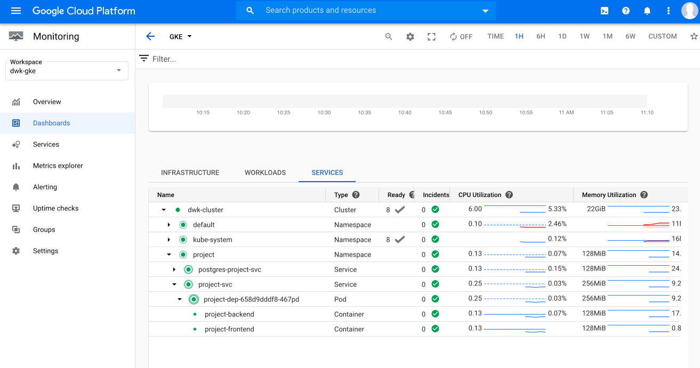
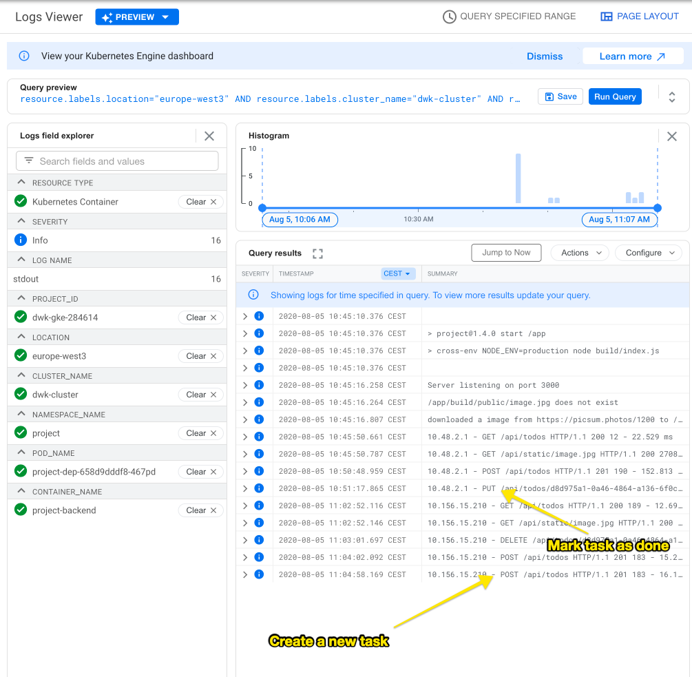
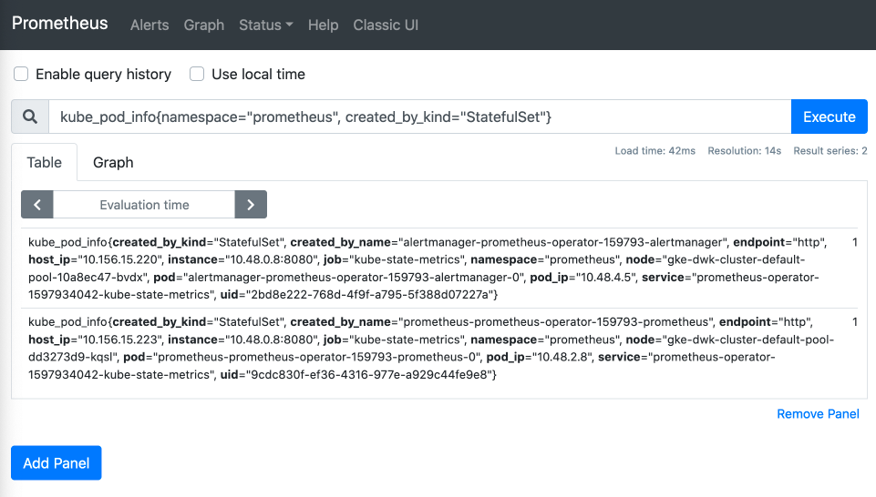
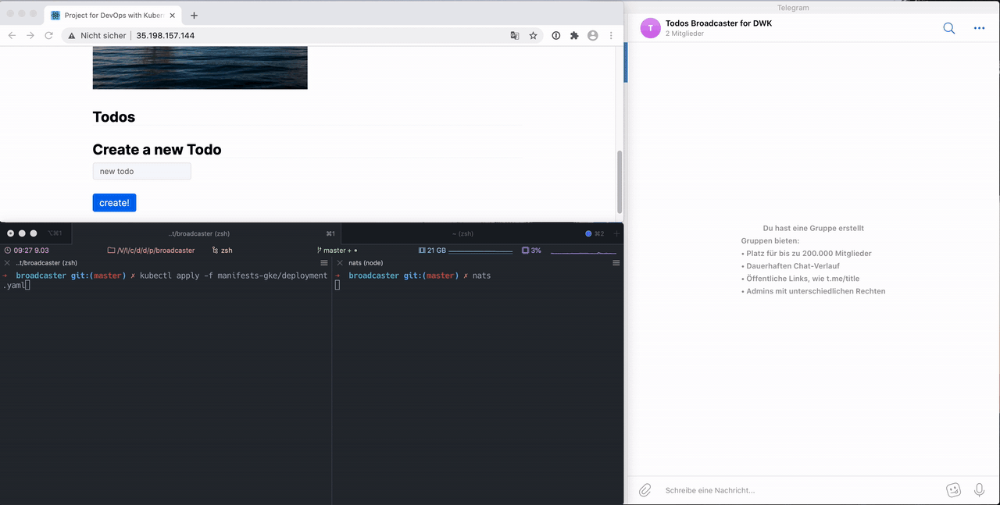

# Solving the DevOps with Kubernetes MOOC

This repo contains my solutions for the exercises of <https://devopswithkubernetes.com/>.

Note: I created my solutions during the beta phase of the course.

- [Solving the DevOps with Kubernetes MOOC](#solving-the-devops-with-kubernetes-mooc)
  - [Solutions for Part 1](#solutions-for-part-1)
  - [Solutions for Part 2](#solutions-for-part-2)
    - [Deploying Solution for Ex. 2.03](#deploying-solution-for-ex-203)
    - [Exercise 2.05](#exercise-205)
    - [Exercise 2.06](#exercise-206)
    - [Exercise 2.07](#exercise-207)
    - [Exercise 2.08](#exercise-208)
  - [Solutions for Part 3](#solutions-for-part-3)
    - [Exercise 3.01: deploy main app and ping/pong to GKE](#exercise-301-deploy-main-app-and-pingpong-to-gke)
    - [Exercise 3.02: automatic GKE deployment for project](#exercise-302-automatic-gke-deployment-for-project)
      - [Install Traefik v2 in my cluster](#install-traefik-v2-in-my-cluster)
    - [Exercise 3.03: Namespace from git branch](#exercise-303-namespace-from-git-branch)
    - [Exercise 3.04: Deleting namespace when branch gets deleted](#exercise-304-deleting-namespace-when-branch-gets-deleted)
    - [Exercise 3.05: DBaaS pro/cons list](#exercise-305-dbaas-procons-list)
    - [Exercise 3.06: Deciding between using PersistentVolumeClaim or Cloud SQL](#exercise-306-deciding-between-using-persistentvolumeclaim-or-cloud-sql)
    - [Exercise 3.07 and 3.08: Ressource limits](#exercise-307-and-308-ressource-limits)
    - [Exercise 3.09: Monitoring with GKE](#exercise-309-monitoring-with-gke)
  - [Solutions for Part 4](#solutions-for-part-4)
    - [Exercise 4.01 Readiness Probes for pingpong and main app](#exercise-401-readiness-probes-for-pingpong-and-main-app)
    - [Exercise 4.02 Readiness and Liveness Probes for frontend/backend of project](#exercise-402-readiness-and-liveness-probes-for-frontendbackend-of-project)
    - [Exercise 4.03 Prometheus](#exercise-403-prometheus)
    - [Exercise 4.04 Canary release with AnalysisTemplate](#exercise-404-canary-release-with-analysistemplate)
    - [Exercise 4.05 PUT Route for project](#exercise-405-put-route-for-project)
    - [Exercise 4.06 Add NATS to project](#exercise-406-add-nats-to-project)
      - [NATS for `project-backend`](#nats-for-project-backend)
      - [`project-broadcaster`: NATS to Telegram](#project-broadcaster-nats-to-telegram)
    - [Exercise 4.07](#exercise-407)

## Solutions for Part 1

| exercise | solution in subfolder        |
| -------- | ---------------------------- |
| 1.01     | `hashgenerator`              |
| 1.02     | `project`                    |
| 1.03     | `hashgenerator`              |
| 1.04     | `project`                    |
| 1.05     | `project`                    |
| 1.06     | `project`                    |
| 1.07     | `hashgenerator`              |
| 1.08     | `project`                    |
| 1.09     | `hashgenerator` & `pingpong` |
| 1.10     | `hashgenerator`              |
| 1.11     | `hashgenerator`              |
| 1.12     | `project`                    |
| 1.13     | `project`                    |

Against [better judgement](https://vsupalov.com/docker-latest-tag/) I used the "latest" tag for some assignments and Kubernetes `yaml` configurations. That's why some solutions can't be played through again, because the automatically built Image at Docker Hub doesn't match the step of the solution anymore. This is especially true for the main application. The project on the other hand is logically tagged.

## Solutions for Part 2

_The solution for exercises are based on each other. For this reason, not all of them are documented here._

### Deploying Solution for Ex. 2.03

```sh
# Create ping/pong app with namespace
$ kubectl create namespace pingpong
namespace/pingpong created
$ kubectl apply -f pingpong/manifests/
deployment.apps/pingpong-dep created
ingress.extensions/pingpong-ingress created
service/pingpong-svc created
# test
$ curl -s http://localhost:8081/pingpong
{"counter":1}
# Create main app in namespace that fetches ping/pongs and prints uuid every 5secs
$ kubectl create namespace hashgenerator
namespace/hashgenerator created
$ kubectl apply -f hashgenerator/manifests/
deployment.apps/hashgenerator-dep created
ingress.extensions/hashgenerator-ingress created
service/hashgenerator-svc created
# test
$ curl -s http://localhost:8081/pingpong
{"counter":2}
$ curl -s http://localhost:8081/
2020-07-17T11:44:52.631Z: 4bdeb719-73cb-482f-b66c-40d04d0d880d<br> 2
# what's in the namespaces?
$ kubens pingpong
Context "k3s-default" modified.
Active namespace is "pingpong".
$ kubectl get all
NAME                                READY   STATUS    RESTARTS   AGE
pod/pingpong-dep-777dbbd675-5kvrr   1/1     Running   0          3m49s

NAME                   TYPE        CLUSTER-IP     EXTERNAL-IP   PORT(S)    AGE
service/pingpong-svc   ClusterIP   10.43.219.90   <none>        6789/TCP   3m49s

NAME                           READY   UP-TO-DATE   AVAILABLE   AGE
deployment.apps/pingpong-dep   1/1     1            1           3m49s

NAME                                      DESIRED   CURRENT   READY   AGE
replicaset.apps/pingpong-dep-777dbbd675   1         1         1       3m49s
$ kubens hashgenerator
Context "k3s-default" modified.
Active namespace is "hashgenerator".
$ kubectl get all
NAME                                     READY   STATUS    RESTARTS   AGE
pod/hashgenerator-dep-66c9cc599d-wgkzg   2/2     Running   0          2m31s

NAME                        TYPE        CLUSTER-IP      EXTERNAL-IP   PORT(S)             AGE
service/hashgenerator-svc   ClusterIP   10.43.228.139   <none>        3001/TCP,2345/TCP   2m31s

NAME                                READY   UP-TO-DATE   AVAILABLE   AGE
deployment.apps/hashgenerator-dep   1/1     1            1           2m31s

NAME                                           DESIRED   CURRENT   READY   AGE
replicaset.apps/hashgenerator-dep-66c9cc599d   1         1         1       2m31s
```

### Exercise 2.05

ConfigMaps for `hashgenerator-server` aka main application

```sh
$ kubectl config set-context --current --namespace=hashgenerator
# Create ConfigMap from `hashgenerator-env-file.properties`
$ cat hashgenerator/manifests/hashgenerator-env-file.properties
SERVER_PORT=3001
GENERATOR_PORT=3002
HASHGENERATOR_URL=http://hashgenerator-svc:2345/
PINGPONG_URL=http://pingpong-svc.pingpong:6789/pingpong
MESSAGE=Hello%
$ kubectl create configmap hashgenerator-config-env-file --from-env-file hashgenerator/manifests/hashgenerator-env-file.properties
configmap/hashgenerator-config-env-file created
# It's live
$ curl -s http://localhost:8081
Hello<br> 2020-07-17T17:25:59.300Z: 14c4d2ff-25f2-4b45-86b8-4b7e3b80b435<br> 13
```

### Exercise 2.06

This spins up two pods. One Deployment with the ping/pong app and one StatefulSet with a PostgreSQL database container. During the creation of the database pod, the very very complex schema gets seeded. The database password is stored as as SealedSecret.

```sh
$ kubectl apply -f pingpong/manifests/
deployment.apps/pingpong-dep created
ingress.extensions/pingpong-ingress created
sealedsecret.bitnami.com/postgres-pw created
service/pingpong-svc created
service/postgres-pingpong-svc created
configmap/postgres-pingpong-seed created
statefulset.apps/postgres-pingpong-stateful created
$ curl -s http://localhost:8081/pingpong
{"counter":4}%
$ kubectl logs -f pingpong-dep-6bcb74f875-w5r72 pingpong

> pingpong@1.0.0 start /app
> node server.js

Writing to txt is disabled
NEVER log a db password to stdin: 'passw0rd'
Server started on: 3000
added a new ping to db
added a new ping to db
added a new ping to db
```

### Exercise 2.07

The state of the todo application gets stored in a PostgreSQL database. The app hooked up via [Sequelize](https://github.com/sequelize/sequelize). The table get created based on the [Task model](https://github.com/movd/devopswithkubernetes/blob/2229fc1779d08d97d4168b44536a96c599a6882c/project/backend/src/models/task.ts). For deployment the db connection parameter and password are stored and read from `secret.yaml`. This time around I'm not using SealedSecret. Only the backend and the deployment setup where changed.

<table>
<tr>
<td width="60%">
<pre lang="sh">
$ kubectl apply -f project/manifests/
deployment.apps/project-dep created
ingress.extensions/project-ingress-frontend created
ingress.extensions/project-ingress-api-static created
persistentvolume/project-pv created
persistentvolumeclaim/project-claim created
secret/postgres-pw-url created
service/project-svc created
service/postgres-project-svc created
statefulset.apps/postgres-project-stateful created
</pre>
</td>
<td width="30%">
<code>http://localhost:8081/project</code><br>
</td>
</tr> 
</table>

### Exercise 2.08

I followed the [steps in the course notes](https://devopswithkubernetes.com/part2/#monitoring) and installed Grafana and Loki via Helm. I added request logging via [morgan](https://github.com/expressjs/morgan) to my project application.

```sh
$ kubectl apply -f project/manifests/
deployment.apps/project-dep created
ingress.extensions/project-ingress-frontend created
ingress.extensions/project-ingress-api-static created
# ...just like in the exercise before
```

Grafana dashboard:

```sh
$ kubectl port-forward prometheus-operator-1595404775-grafana-7964b4fb7d-4hflq 3000
Forwarding from 127.0.0.1:3000 -> 3000
Forwarding from [::1]:3000 -> 3000
Handling connection for 3000
```


## Solutions for Part 3

### Exercise 3.01: deploy main app and ping/pong to GKE

Create cluster in Frankfurt with two nodes and connect to it:

```sh
$ gcloud container clusters create dwk-cluster --zone=europe-west3 --num-nodes=2
Creating cluster dwk-cluster in europe-west3... Cluster is being configured...Cluster is being deployed...Cluster is being health-checked...done.
Created [https://container.googleapis.com/v1/projects/dwk-gke-123456/zones/europe-west3/clusters/dwk-cluster].
To inspect the contents of your cluster, go to: https://console.cloud.google.com/kubernetes/workload_/gcloud/europe-west3/dwk-cluster?project=dwk-gke-123456
kubeconfig entry generated for dwk-cluster.
NAME         LOCATION      MASTER_VERSION  MASTER_IP     MACHINE_TYPE   NODE_VERSION   NUM_NODES  STATUS
dwk-cluster  europe-west3  1.15.12-gke.2   34.89.245.27  n1-standard-1  1.15.12-gke.2  6          RUNNING

$ gcloud container clusters get-credentials dwk-cluster --region europe-west3 --project dwk-gke-123456
Fetching cluster endpoint and auth data.
kubeconfig entry generated for dwk-cluster
```

Create ping/pong App with it's own public ip adress. So that external users can ping it via:`http://EXTERNAL-IP/pingpong`. The `hashgenerator-server` reaches it internally via `http://pingpong-svc.pingpong:6789/pingpong`

```
$ kubectl create namespace pingpong
namespace/pingpong created
$ kubectl apply -f pingpong/manifests-gke/
deployment.apps/pingpong-dep created
secret/postgres-pw created
service/pingpong-svc-loadbalancer created
service/pingpong-svc created
service/postgres-pingpong-svc created
configmap/postgres-pingpong-seed created
statefulset.apps/postgres-pingpong-stateful created
$ kubens pingpong
Context "gke_dwk-gke-123456_europe-west3_dwk-cluster" modified.
Active namespace is "pingpong".
# Wait for external IP...
$ kubectl get svc --watch
NAME                        TYPE           CLUSTER-IP      EXTERNAL-IP   PORT(S)        AGE
pingpong-svc                ClusterIP      10.51.248.145   <none>        6789/TCP       42s
pingpong-svc-loadbalancer   LoadBalancer   10.51.246.118   <pending>     80:31106/TCP   42s
postgres-pingpong-svc       ClusterIP      10.51.255.120   <none>        5432/TCP       42s
pingpong-svc-loadbalancer   LoadBalancer   10.51.246.118   34.89.233.5   80:31106/TCP   50s
```

ping to pong:

```sh
$ curl -s http://34.89.233.5/pingpong
{"counter":0}%
$ curl -s http://34.89.233.5/pingpong
{"counter":1}%
```

Create the hashgenerator app + server:

```
$ kubectl create namespace hashgenerator
namespace/hashgenerator created
$ kubens hashgenerator
Context "gke_dwk-gke-123456_europe-west3_dwk-cluster" modified.
Active namespace is "hashgenerator".
$ kubectl apply -f hashgenerator/manifests-gke/
configmap/hashgenerator-config-env-file created
deployment.apps/hashgenerator-dep created
service/hashgenerator-svc-loadbalancer created
service/hashgenerator-svc created
# Wait for external IP address
$ kubectl get svc --watch
NAME                             TYPE           CLUSTER-IP      EXTERNAL-IP   PORT(S)        AGE
hashgenerator-svc                ClusterIP      10.51.249.229   <none>        2345/TCP       35s
hashgenerator-svc-loadbalancer   LoadBalancer   10.51.241.121   <pending>     80:32281/TCP   35s
hashgenerator-svc-loadbalancer   LoadBalancer   10.51.241.121   35.242.205.114   80:32281/TCP   42s
```

Both `LoadBalancer`s should be running now:

```sh
$ kubectl get svc --all-namespaces | grep LoadBalancer
hashgenerator   hashgenerator-svc-loadbalancer   LoadBalancer   10.51.241.121   35.242.205.114   80:32281/TCP    6m17s
pingpong        pingpong-svc-loadbalancer        LoadBalancer   10.51.246.118   34.89.233.5      80:31106/TCP    10m
```

It works:

```sh
$ curl http://35.242.205.114/
Hello<br> 2020-07-27T16:55:59.611Z: 5fa214bc-a6a5-4fc7-ad28-8dd7c8bc0b53<br> 2%
$ kubectl logs hashgenerator-dep-5764f96cc5-jrq4z --all-containers
HASHGENERATOR_URL: http://hashgenerator-svc:2345/
HASHFILE_PATH: undefined
PINGPONG_URL: http://pingpong-svc.pingpong:6789/pingpong
PINGPONGFILE_PATH: undefined
Server started on: 3001
::ffff:10.48.5.1 requested a hashFile + pingPongFile
Writing to txt is disabled
Server started on: 3002
current: 2020-07-27T16:55:19.580Z: 6f2c833d-c268-4c92-a4a2-045710d48615
current: 2020-07-27T16:55:24.581Z: 2b83ff58-b42d-4bb4-9c9a-8937bfa9e8f9
current: 2020-07-27T16:55:29.586Z: 79261074-c50a-433e-8557-1d55269857d4
current: 2020-07-27T16:55:34.591Z: 82d34fad-04b6-4227-97da-61d73baf418a
```

Delete the cluster:

```
$ gcloud container clusters delete dwk-cluster
The following clusters will be deleted.
 - [dwk-cluster] in [europe-west3]

Do you want to continue (Y/n)?  y

Deleting cluster dwk-cluster...⠹
```

### Exercise 3.02: automatic GKE deployment for project

At first I created a cluster `dwk-cluster` like in the [exercise before](exercise-301). I also decided to switch from the default GKE Ingress to Traefik v2. I had problems creating rewrite rules with Google's default Ingress ([it looks like I'm not the only one](https://github.com/kubernetes/ingress-gce/issues/109)). Since I need this function to prevent the backend and frontend of my CRUD app from interfering with each other, I decided to use Traefik v2 instead of the standard Ingress Controller.

#### Install Traefik v2 in my cluster

```
$ kubectl create namespace project
namespace/project created
$ kubectl config set-context --current --namespace=project
Context "gke_dwk-gke-284614_europe-west3_dwk-cluster" modified.
$ helm repo add traefik https://containous.github.io/traefik-helm-chart && \
  helm repo update && \
  helm install traefik traefik/traefik
"traefik" has been added to your repositories
Hang tight while we grab the latest from your chart repositories...
...Successfully got an update from the "traefik" chart repository
...Successfully got an update from the "loki" chart repository
...Successfully got an update from the "stable" chart repository
Update Complete. ⎈ Happy Helming!⎈
NAME: traefik
LAST DEPLOYED: Fri Jul 31 17:37:27 2020
NAMESPACE: project
STATUS: deployed
REVISION: 1
TEST SUITE: None
```

The helm chart creates a LoadBalancer service. Like manually created Service in the exercise before this gets a public external IP address:

```sh
$ kubectl get service --watch
NAME      TYPE           CLUSTER-IP     EXTERNAL-IP     PORT(S)                      AGE
traefik   LoadBalancer   10.51.247.87   35.234.119.98   80:31601/TCP,443:30377/TCP   5m43s
```

With the cluster running and Traefik installed my automatic deployment for the project will work.

### Exercise 3.03: Namespace from git branch

Added a new [Action workflow yaml](https://github.com/movd/devopswithkubernetes/blob/master/.github/workflows/project-build-deploy-gke-branch.yml) so that when pushing to a branch. The application gets deployed into a namespace with the same name as the branch.

### Exercise 3.04: Deleting namespace when branch gets deleted

Added a new a new Action workflow: [project-delete-branch-namespace.yml](https://github.com/movd/devopswithkubernetes/blob/master/.github/workflows/project-delete-branch-namespace.yml)

### Exercise 3.05: DBaaS pro/cons list

In the following a short pro and contra list which compares Database as a Service vs. self configured and deployed database solutions. I have informed myself about the subject at [DBaaS providers](https://www.snia.org/sites/default/orig/DSI2014/presentations/CloudStor/CashtonColeman_Database_Service_MySQL_Cloud_Final.pdf), in [magazine articles](https://www.cloudcomputing-insider.de/was-ist-database-as-a-service-dbaas-a-692502/) and forums<sup>[1](https://stackoverflow.com/questions/23766951/cloud-sql-vs-self-maintained-database), [2](https://news.ycombinator.com/item?id=19578890)</sup>.

**Pros for DBaaS:**

- Very easy to setup ➡️ no own know-how or personell necessary for the operation of the database server
- scalability and elasticity
- High Availability such as replications are provided
- Easy backups (point in time recovery)
- The billing is usage-based

**Cons against DBaaS:**

- The billing is usage-based ➡️ Unpredictable costs can arise during peak loads
- You need to trust the provider: Legal requirements may prohibit storing personal data on servers of third parties
- Upgrades must be installed by the provider
- No far-reaching changes to the server configuration are possible

### Exercise 3.06: Deciding between using PersistentVolumeClaim or Cloud SQL

Because I have already used PersistentVolumeClaims I stuck to it. To ensure that the data in the database is preserved, I [set the Reclaim policy to `Retain`](https://kubernetes.io/docs/tasks/administer-cluster/change-pv-reclaim-policy/) for the automatically created PersistentVolume of my PersistentVolumeClaim. (GKE takes care of creating the PV for the PVC).

```sh
$ kubectl patch pv pvc-e662f066-fb2d-4efa-98fe-130743e5f77a -p '{"spec":{"persistentVolumeReclaimPolicy":"Retain"}}'
```

### Exercise 3.07 and 3.08: Ressource limits

As I already ran into ressource limits and quotas while using `k3d` and the [VScode Extension](https://marketplace.visualstudio.com/items?itemName=ms-kubernetes-tools.vscode-kubernetes-tools) was constantly nagging me constantly to set `limits` my applications already had ressource tried and tested limits set.

### Exercise 3.09: Monitoring with GKE

While creating the cluster I added `--enable-stackdriver-kubernetes`:

```sh
gcloud container clusters create dwk-cluster --zone=europe-west3 --enable-stackdriver-kubernetes --num-nodes=2
```

Now I could marvel at both monitoring and logging in the Cloud Console:





## Solutions for Part 4

### Exercise 4.01 Readiness Probes for pingpong and main app

_All steps in my solutions to this exercise were executed on a local minikube cluster with the [NGINX Ingress controller installed](https://kubernetes.io/docs/tasks/access-application-cluster/ingress-minikube/). The configuration should be the same on GKE._

**I. Readiness Probes for ping/pong app**

When commenting out the environment variable section in `pingpong/manifests/deployment.yaml`. My app will default `POSTGRES_HOST` to `localhost` instead of right the service hostname. Thus no connection to the database will succeed. The app is unhealhty.

Steps to reproduce:

Comment out env variables in `pingpong/manifests/deployment.yaml`:

```yaml
# env:
#   - name: POSTGRES_HOST
#     value: "postgres-pingpong-svc"
```

Apply the manifests:

```sh
$ kubectl apply -f pingpong/manifests
$ kubectl get pod --watch
NAME                            READY   STATUS    RESTARTS   AGE
pingpong-dep-588f7f998d-9b5f7   0/1     Running   0          7s
pingpong-dep-588f7f998d-9kjlp   0/1     Running   0          7s
pingpong-dep-588f7f998d-pkb9z   0/1     Running   0          7s
```

Why is it not entering Ready state???

```sh
$ kubectl describe pod pingpong-dep-588f7f998d-9b5f7
...
Events:
  Type     Reason     Age               From               Message
  [...]
  Normal   Created    36s               kubelet, minikube  Created container pingpong
  Normal   Started    36s               kubelet, minikube  Started container pingpong
  Warning  Unhealthy  0s (x7 over 30s)  kubelet, minikube  Readiness probe failed: HTTP probe failed
```

My `/healthz` endpoint returns the following output:

```
$ kubectl port-forward pingpong-dep-588f7f998d-9b5f7 3000:3000
$ curl -s localhost:3000/healthz | jq '.'
{
  "status": "connect ECONNREFUSED 127.0.0.1:5432",
  "hostname": "pingpong-dep-588f7f998d-9b5f7"
}
$ curl -sI localhost:3000/healthz
HTTP/1.1 400 Bad Request
[...]
```

Fixing the `deployment.yaml` be uncommenting the env variable:

```yaml
    spec:
      containers:
        - name: pingpong
          image: movd/devopswithkubernetes-pingpong:sha-746a640
          env:
            - name: POSTGRES_HOST
              value: "postgres-pingpong-svc"
              ...
```

After reapplying the manifests all pods are started sucessfully.

```sh
$ kubectl apply -f pingpong/manifests
$ kubectl get pod --watch
NAME                            READY   STATUS    RESTARTS   AGE
pingpong-dep-567dbf4bd9-cnnws   0/1     Running   0          3s
pingpong-dep-567dbf4bd9-frdwp   1/1     Running   0          14s
pingpong-dep-567dbf4bd9-sg5vv   1/1     Running   0          8s
pingpong-dep-588f7f998d-9b5f7   0/1     Running   0          12m
postgres-pingpong-stateful-0    1/1     Running   0          12m
pingpong-dep-567dbf4bd9-cnnws   1/1     Running   0          4s
pingpong-dep-588f7f998d-9b5f7   0/1     Terminating   0          12m
```

**II. Readiness Probes for hashgenerator (main app)**

If the previously created deployment of the pingpong app is deleted, the main application will not become Ready. I'll be brief this time:

```sh
$ kubectl create configmap hashgenerator-config-env-file --from-env-file manifests/hashgenerator-env-file.properties
configmap/hashgenerator-config-env-file created
$ kubectl apply -f hashgenerator/manifests
deployment.apps/hashgenerator-dep created
...
$ kubectl delete -f pingpong/manifests
deployment.apps "pingpong-dep" deleted
...
$ kubectl rollout restart deployment hashgenerator-dep
deployment.apps/hashgenerator-dep restarted
...
$ kubectl get pods --watch
NAME                                 READY   STATUS    RESTARTS   AGE
hashgenerator-dep-5b84db6b5b-jtsf6   1/2     Running   0          4m19s
hashgenerator-dep-8677c5f6b8-8gd98   1/2     Running   0          24s
$ kubectl describe pods hashgenerator-dep-8677c5f6b8-8gd98
[...]
Events:
  Type     Reason     Age               From               Message
  [...]
  Normal   Created    45s               kubelet, minikube  Created container hashgenerator
  Normal   Started    45s               kubelet, minikube  Started container hashgenerator
  Warning  Unhealthy  5s (x9 over 45s)  kubelet, minikube  Readiness probe failed: HTTP probe failed with statuscode: 400
```

### Exercise 4.02 Readiness and Liveness Probes for frontend/backend of project

_This exercise was solved via a GKE cluster._

The application has an API endpoint [`:3000/api/healthz`](https://github.com/movd/devopswithkubernetes/blob/master/project/backend/src/routes/healthz.ts). If wrong database credentials are set up or the connection to the database times out the backend container becomes unhealthy. The frontend is checked at `:80/` (nginx).

To try out how my app behaves when no volumes are mounted I commented out the PersistentVolumeClaims.

<table>
<tr>
<td width="45%" valign="top">
Backend probes
<pre lang="yaml">
          readinessProbe:
            initialDelaySeconds: 5
            timeoutSeconds: 5
            periodSeconds: 5
            failureThreshold: 5
            successThreshold: 1
            httpGet:
              path: /api/healthz?readiness
              port: 3000
          livenessProbe:
            initialDelaySeconds: 30
            periodSeconds: 60 # every 60 seconds
            failureThreshold: 10
            httpGet:
              path: /api/healthz?liveness
              port: 3000
</pre>
</td>
<td width="45%" valign="top">
Frontend probe
<pre lang="yaml">
          readinessProbe:
            initialDelaySeconds: 1
            timeoutSeconds: 5
            periodSeconds: 5
            successThreshold: 1
            httpGet:
              path: /
              port: 80
</pre>
</td>
</tr> 
</table>

### Exercise 4.03 Prometheus

_This exercise was solved via a GKE cluster._

Installed Prometheus via helm like show in the course notes.

```
$ kubectl port-forward -n prometheus prometheus-prometheus-operator-159793-prometheus-0 9090 &
Forwarding from [::1]:9090 -> 9090
Handling connection for 9090
```

<http://localhost:9090>



`scalar(sum(kube_pod_info{namespace="prometheus", created_by_kind="StatefulSet"}))`

returns:

| Element | Value |
| ------- | ----- |
| scalar  | 2     |

### Exercise 4.04 Canary release with AnalysisTemplate

My test runs for 10 minutes and checks that the memory consumption does not exceed 652.8 Mb. _Based on my memory ressource limits per container (128*6)*0.85_.

First I deleted the Deployment, switched to a Rollout and added my [AnalysisTemplate](https://github.com/movd/devopswithkubernetes/blob/master/project/manifests-gke/analysistemplate.yaml).

```sh
$ kubectl apply -n argo-rollouts -f https://raw.githubusercontent.com/argoproj/argo-rollouts/stable/manifests/install.yaml
customresourcedefinition.apiextensions.k8s.io/analysisruns.argoproj.io unchanged
[...]
$ kubectl delete deployments.apps project-dep
deployment.apps "project-dep" deleted
$ kubectl apply -f project/manifests-gke/analysistemplate.yaml
analysistemplate.argoproj.io/memory-consumption-after-start created
$ kubectl apply -f project/manifests-gke/rollout.yaml
rollout.argoproj.io/project-dep created
```

After that I updated the backend from 1.7.0 to 1.7.1 in `rollout.yaml`:

```
$ kubectl apply -f project/manifests-gke/rollout.yaml
rollout.argoproj.io/project-dep configured
$ kubectl get analysisruns.argoproj.io project-dep-86c4f867f-4-1 --watch
NAME                        STATUS
project-dep-86c4f867f-4-1   Running
project-dep-86c4f867f-4-1   Running
```

I have configured it so that 25% of my pods are tested for 10 minutes before the upgrade is rolled out completly. With my 3 replicas, this results in one extra pod, running the newer version:

```sh
$ kubectl get pods
NAME                           READY   STATUS    RESTARTS   AGE
postgres-project-stateful-0    1/1     Running   0          22h
project-dep-7c74d795d4-mhpkb   2/2     Running   0          6m3s
project-dep-7c74d795d4-srcxs   2/2     Running   0          6m3s
project-dep-7c74d795d4-vlrkx   2/2     Running   0          6m3s
project-dep-86c4f867f-7fm65    2/2     Running   0          14s
```

The newest pod is running v1.7.1:

```sh
$ kubectl get pod \
    -o=jsonpath='{range .items[*]}{.metadata.namespace}, {.metadata.name}, {.spec.containers[].image}{"\n"}'
project, postgres-project-stateful-0, postgres:10-alpine
project, project-dep-7c74d795d4-mhpkb, docker.io/movd/devopswithkubernetes-project-backend:v1.7.0
project, project-dep-7c74d795d4-srcxs, docker.io/movd/devopswithkubernetes-project-backend:v1.7.0
project, project-dep-7c74d795d4-vlrkx, docker.io/movd/devopswithkubernetes-project-backend:v1.7.0
project, project-dep-86c4f867f-7fm65, docker.io/movd/devopswithkubernetes-project-backend:v1.7.1
```

_Thanks to eldada for this very [handy snippet](https://github.com/eldada/kubernetes-scripts#get-formatted-list-of-container-images-in-pods)!_

Now some users could already use the new version. _For this, to work I added the hostname of the pod to the API response._

```sh
$ while sleep 1; do curl -s http://35.234.93.113/api/todos | jq '.hostname'; done
"project-dep-7c74d795d4-mhpkb"
"project-dep-7c74d795d4-vlrkx"
"project-dep-7c74d795d4-srcxs"
"project-dep-86c4f867f-7fm65" # Pod with new version
"project-dep-7c74d795d4-mhpkb"
```

After testing for ten minutes two additional replicas got added with the new version. All old called `project-dep-7c74d795d-*` where deleted.

```sh
$ do kubectl get pods --watch
NAME                           READY   STATUS        RESTARTS   AGE
postgres-project-stateful-0    1/1     Running       0          22h
project-dep-7c74d795d4-mhpkb   0/2     Terminating   0          16m
project-dep-86c4f867f-7fm65    2/2     Running       0          10m
project-dep-86c4f867f-d2t72    2/2     Running       0          30s
project-dep-86c4f867f-f4f9p    2/2     Running       0          19s
```

All pods now run the newest version:

```sh
$ kubectl get pod \
    -o=jsonpath='{range .items[*]}{.metadata.namespace}, {.metadata.name}, {.spec.containers[].image}{"\n"}'
project, postgres-project-stateful-0, postgres:10-alpine
project, project-dep-86c4f867f-7fm65, docker.io/movd/devopswithkubernetes-project-backend:v1.7.1
project, project-dep-86c4f867f-d2t72, docker.io/movd/devopswithkubernetes-project-backend:v1.7.1
project, project-dep-86c4f867f-f4f9p, docker.io/movd/devopswithkubernetes-project-backend:v1.7.1
```

### Exercise 4.05 PUT Route for project

```sh
$ curl -s -X GET http://35.234.93.113/api/todos | jq '.todos'
[
  {
    "id": "b4be36c5-14ea-4429-bfb4-a169993d013d",
    "userId": null,
    "task": "Buy milk",
    "done": false,
    "createdAt": "2020-08-21T12:45:51.104Z",
    "updatedAt": "2020-08-21T12:45:51.104Z"
  }
]
$ curl -s -X PUT -H "Content-Type: application/json" \
  -d '{"task": "Buy milk","done": true}' \
   http://35.234.93.113/api/todos/b4be36c5-14ea-4429-bfb4-a169993d013d | jq
{
  "task": "Buy milk",
  "done": true,
  "id": "b4be36c5-14ea-4429-bfb4-a169993d013d"
}
```

### Exercise 4.06 Add NATS to project

#### NATS for `project-backend`

If the `NATS_URL` environment variable is set the backend sends messages to NATS on create, update, and deletion of tasks:

| Action                 | NATS queue      | NATS payload              |
| ---------------------- | --------------- | ------------------------- |
| POST /api/todos        | `todos.created` | JSON of created task      |
| PUT /api/todos/uuid    | `todos.updated` | JSON of updated task      |
| DELETE /api/todos/uuid | `todos.deleted` | JSON of just deleted task |

The JSON objects stem directly from sequelizeand always contains:  
`{id:uuidv4, userId: null, task: string, done: boolean, createdAt: timestamp, updatedAt: timestamp}`

#### `project-broadcaster`: NATS to Telegram

"project-broadcaster" is subscribing to NATS. It listens to messages that are sent by the backend to either the queue "todos.created", "todos.updated" or "todos.deleted". The JSON payload gets forwarded in a message to a Telegram Chat informing the admin on the just happened change.

"project-broadcaster" requires the following environmental variables:

- NATS_URL = `nats://my-nats:4222`
- TELEGRAM_ACCESS_TOKEN = looks something like `123456:ABC-DEF1234ghIkl-zyx57W2v1u123ew11`
- TELEGRAM_CHAT_ID= looks something like `-987654321`

Both token and chat id must be acquired using the [Telegram API](https://core.telegram.org/bots/api).

The broadcaster can be scaled horizontally without Telegram messages getting sent by multiple subscribers/replicas at the same time. This is achieved by using NATS queue groups. My replicas join the queue "todos_broadcasters".

> As messages on the registered subject are published, one member of the group is chosen randomly to receive the message. Although queue groups have multiple subscribers, each message is consumed by only one.

Source: <https://docs.nats.io/nats-concepts/queue>

Here is an example how it behaves during runtime:



Whats going on here?

The deployment is installed in the left pane of the terminal. In the right pane [nats-cli](https://www.npmjs.com/package/nats-cli) is listening. It prints all messages unfiltered.

This works because `kubectl -n project port-forward my-nats-0 4222` was executed in the second tab which is not visible.

### Exercise 4.07

_While I was working on my solutions, exercises 6 and 7 were one. In the final course, they will get split into two consecutive tasks._
